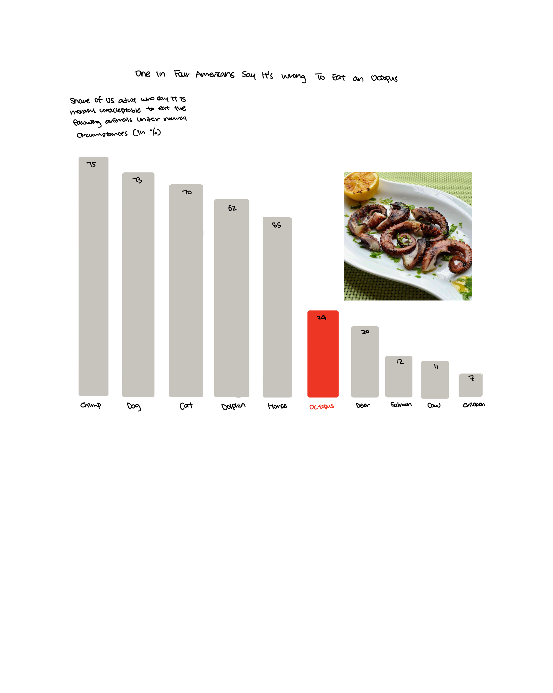

| [home page](https://cmustudent.github.io/tswd-portfolio-templates/) | [data viz examples](dataviz-examples) | [critique by design](critique-by-design) | [final project I](final-project-part-one) | [final project II](final-project-part-two) | [final project III](final-project-part-three) |

# One in Four Americans Say It's Wrong To Eat an Octopus

_For each step below, you should document your progress as you move forward.  In terms of tone, think of the writeup as though you're keeping journal of your step-by-step process.   You should include a any insights you gained from the critique method, and what it led you to think about when considering the redesign.  You should talk about how you moved next to the sketches, and any insights you gleaned from your user feedback.  Document what you changed based on the user feedback in your redesign.  Finally, talk about what your redesigned data visualization shows, why you selected the data visualization you did, and what you attempted to show or do differently._

_You can include screenshots, sketches or other artifacts with your narrative to help tell the story of how you moved through the process.  Again, make sure to avoid including any personally identifying information about your interviewees (don't list full names, etc.).  While this template serves as a guide, make sure to reference the assignment writeup on Canvas for the official guidance.  This template does not include all guidance mentioned on the assignment page._

## Step one: the visualization

This is the original data visualization: https://www.statista.com/chart/30299/us-survey-on-ethics-of-eating-animals/
I selected this topic because I am interested in food culture. I was so surprised to see that 1/4 of the Americans surveyed think it is morally unacceptable to eat octopus, even though octopus is a popular cuisine in many countries like Spain. I also want to see if there are any patterns in why people categorize animals as morally consumable or not. This might also reveal cultural differences that are interesting to notice worldwide.

## Step two: the critique
I think, overall, the graph is pretty self-explanatory with a really descriptive title that sums up the overall observation of the study. However, aesthetic-wise, the colors of the bars are too similar, which blurs the focus on the octopus bar. I also think that though adding a graphic of octopus with a fork does make the visualization more engaging, a cartoon might make the whole study less serious and formal. I also think that the context for the source of the data is insufficient since though it mentioned that they conducted a survey among 1000 adults in the United States, it did not specify the demographic like whether they are animal activists, religious, or others, which could significantly affect the answers and lead to biases. 

## Step three: Sketch a solution

## Step four: Test the solution

Questions to ask : 

- Can you tell me what you think this is?
- Do you think the bar graph helps with this storytelling?
- What do you think of the colors?
- Can you describe to me what this is telling you?
- What do you feel about making the result of the study as the title?
- Is there anything you find surprising or confusing?
- Who do you think is the intended audience for this?
- Do you think the data is reliable?
- Is there anything you would change or do differently?

Results: 
Groupmates:
student, Mism program
student, MSPPM program
student, urban planning program

Synthesis: 
I received the most feedback for my graphic, where though I changed the cartoon into an actual octopus cuisine picture, my groupmates found it very distracting and diluted the attention from my graph. I think for this problem, I will either insert the image into the octopus bar or just remove the picture for simplicity. Also, I was given feedback that, in addition to the numbers for the percentage of people who think eating octopus is unacceptable, they also want to see the numbers who think it is acceptable.

## Step five: build the solution

_Include and describe your final solution here. It's also a good idea to summarize your thoughts on the process overall. When you're done with the assignment, this page should all the items mentioned in the assignment page on Canvas(a link or screenshot of the original data visualization, documentation explaining your process, a summary of your wireframes and user feedback, your final, redesigned data visualization, etc.)._

<noscript></noscript><object class='tableauViz'  style='display:none;'><param name='host_url' value='https%3A%2F%2Fpublic.tableau.com%2F' /> <param name='embed_code_version' value='3' /> <param name='site_root' value='' /><param name='name' value='redesign_17393838403570&#47;Sheet23' /><param name='tabs' value='no' /><param name='toolbar' value='yes' /><param name='static_image' value='https:&#47;&#47;public.tableau.com&#47;static&#47;images&#47;re&#47;redesign_17393838403570&#47;Sheet23&#47;1.png' /> <param name='animate_transition' value='yes' /><param name='display_static_image' value='yes' /><param name='display_spinner' value='yes' /><param name='display_overlay' value='yes' /><param name='display_count' value='yes' /><param name='language' value='en-US' /><param name='filter' value='publish=yes' /></object>
  

## References
_List any references you used here._

## AI acknowledgements
_If you used AI to help you complete this assignment (within the parameters of the instruction and course guidelines), detail your use of AI for this assignment here._

